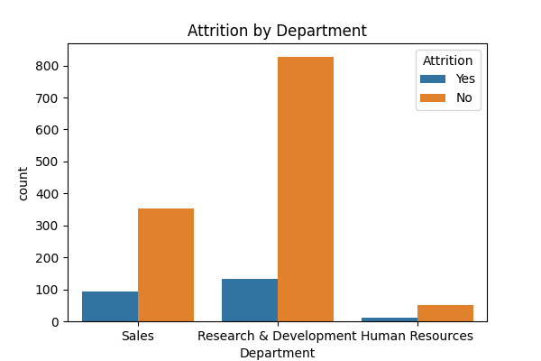
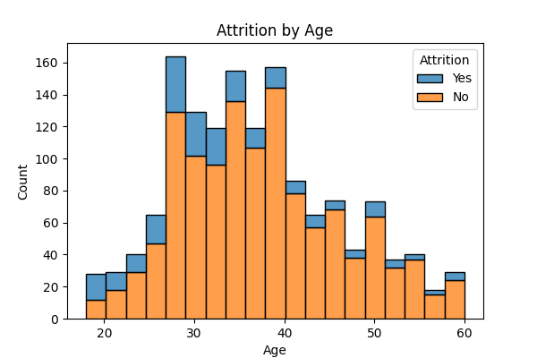

# HR Data Analyzer (Python)

A simple HR analytics project using Python, Pandas, and Seaborn to analyze employee attrition trends from the IBM HR Analytics dataset.

## Objectives
- Explore and visualize employee attrition patterns.
- Identify departments and age groups with higher attrition.
- Practice Python data analysis and visualization skills.

## Tools & Libraries
- Python
- Pandas
- Matplotlib
- Seaborn

## Insights
- Overall attrition rate: ~16%
- Highest attrition: R&D Department
- Most employees leaving are between ages 20–30

## How to Run
1. Clone the repo  
2. Install dependencies  
   ```bash
   pip install pandas matplotlib seaborn

## Sample Outputs




